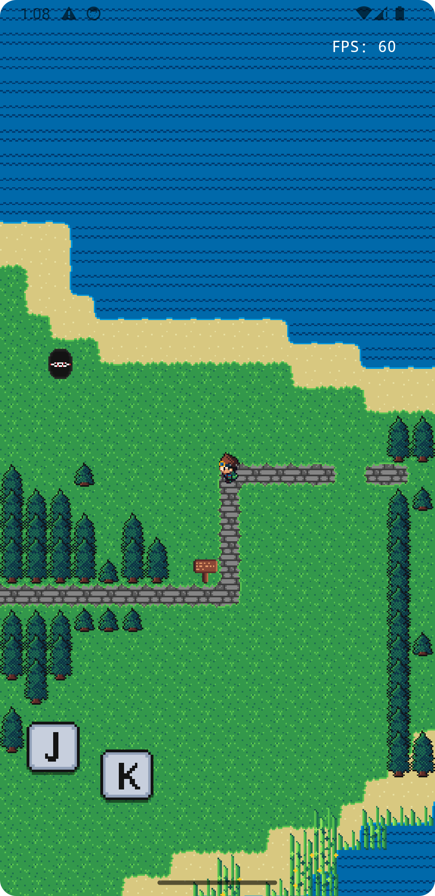
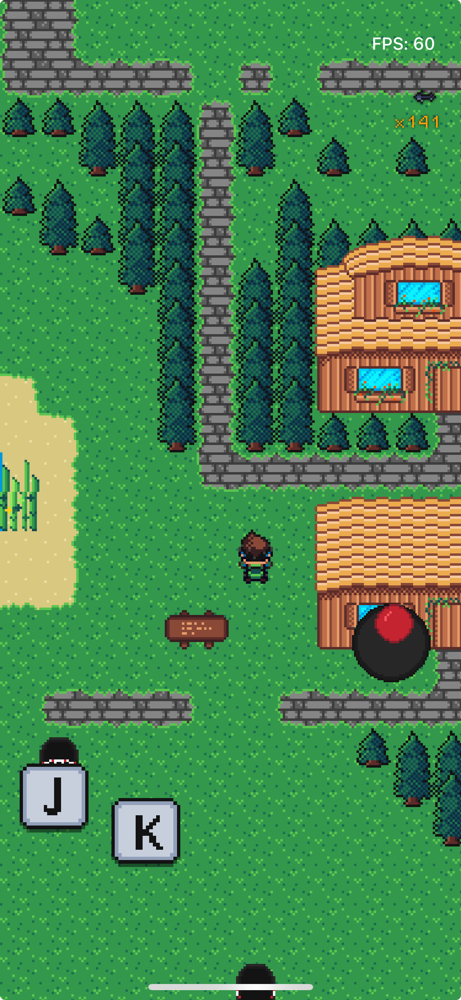

# SneakBit

So, I got bored, wanted to speriment a bit with Rust, and love GameBoy games, here's the result!

I really enjoyed the process, but have no idea what the final result should be, for now at least.

Open to contributions and ideas!

## Run
```bash
# Run the game
cargo run

# Run the game in creative mode to build levels
cargo run creative
```

### Windows
The project uses raylib, so you will need to setup and add to path cmake, libc and the usual stuff before running the steps above.

Personally (but I have no idea what I'm doing and haven't used a windows machine in 10+ years) I did the following:
1. Installed CMake from [here](https://cmake.org/download/)
2. Added CMake to path
3. Installed LLVM via `winget install LLVM.LLVM`
4. `cargo run` 

### iOS and Android
The engine is the same, the rendering is a simple set of custom views.

I have a bunch of helpers to generate and copy over resources to the correct places in the mobile projects:
```bash
# Aseprite -> Png
python3 scripts/compile_sprites.py

# Copy ALL assets, including headers to ios and android projects
python3 scripts/sync_assets.py
```

As a simple but significant optimization,iOS and Android use a pre-rendered image instead of rendering individual tiles, which is much, much faster.

#### iOS
The build uses cargo-lipo, just run the script and open the project in Xcode.
```bash
sh scripts/build_ios.sh
```

#### Android
The build uses cargo-ndk, just run the script and open the project in Android Studio.
```bash
sh scripts/build_android.sh
```

## Why lib + bin?
I'm trying to have the engine by completely independent from rendering, which has proved useful for porting the project to iOS and Android.

## Screenshots





## TODO:
- Lots.