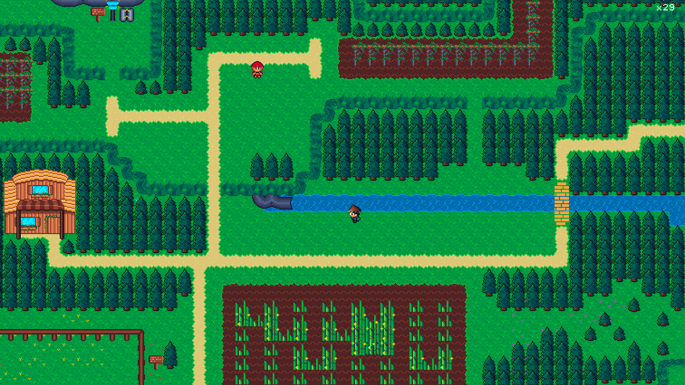
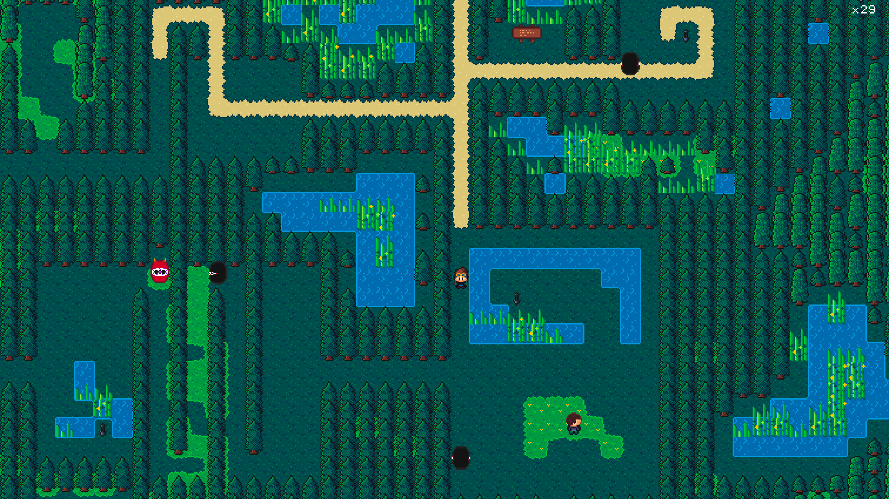
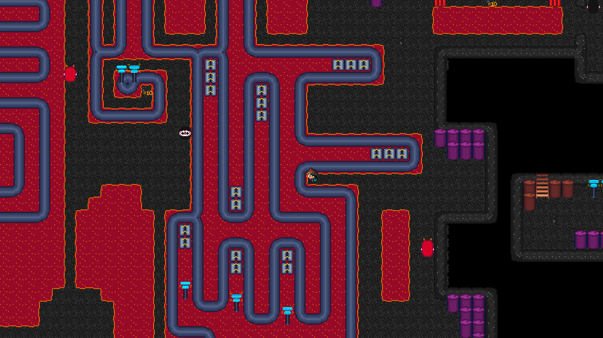
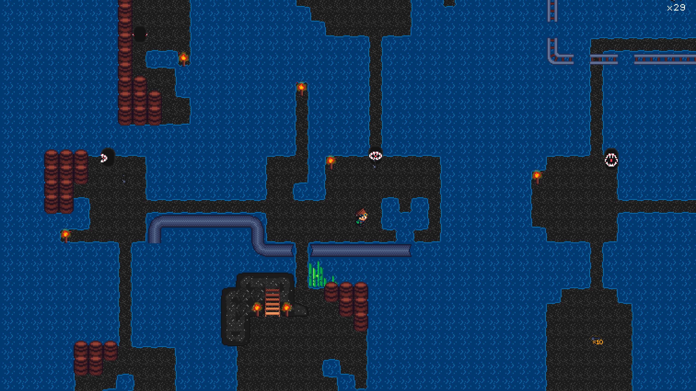
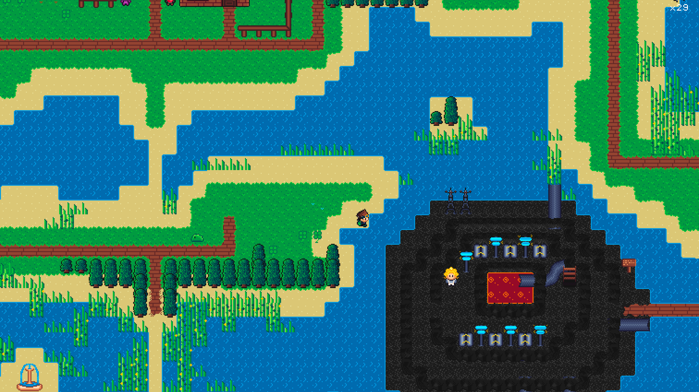

<br>
Got bored, started sperimenting a bit with Rust, ended up with a game!

Like the game or have cool ideas? Join the [Discord](https://discord.gg/MCdEgXKSH5)!

## Play it now!
<div style="display: flex; gap: 10px; justify-content: left; margin: 20px 0;">
<!--
    <a href="https://discord.gg/MCdEgXKSH5">
        
    </a> -->
    <a href="https://apps.apple.com/app/sneakbit/id6737452377">
        
    </a>
</div>

Coming soon to the Play Store for Android and to Steam for Linux, Windows and macOS.

Please consider buying the game from any store to support the project 🙏

## Build from source
### macOS, Linux
```bash
# Run the game
cargo run --package game

# Run the game in creative mode to build levels
cargo run --package game creative
```

### Windows
The project uses [Raylib](https://docs.rs/raylib/latest/raylib/), so you will need to setup and add to path cmake, libc and the usual stuff before running the steps above.

Personally (but I have no idea what I'm doing and haven't used a windows machine in 10+ years) I did the following:
1. Installed CMake from [here](https://cmake.org/download/)
2. Added CMake to path
3. Installed LLVM via `winget install LLVM.LLVM`
4. `cargo run --package game` 

### iOS and Android
The engine is the same, the rendering is a simple set of custom views for the game itself, menus and such

The `game_core` create is compiled via `cargo-lipo` and `cargo-ndk`.

The `build_all.sh` script will build `game_core`, compile all resources and copy them to the correct folders for both mobile projects.
```bash
sh scripts/build_all.sh
```

## Screenshots






## Credits
* Music by [Filippo Vicarelli](https://www.filippovicarelli.com/8bit-game-background-music)
* Sound Effects by [SubspaceAudio](https://opengameart.org/content/512-sound-effects-8-bit-style)
* Font by [HarvettFox96](https://dl.dafont.com/dl/?f=pixel_operator)

## TODO:
- Make slopes reflect bullets
- More Quests
- More Lore
- More Game!

## Game Design Document
> Warning: Spoilers!

Notes about lore, quests and characters can be found [here](https://github.com/curzel-it/sneakbit/blob/main/docs/game_design_document.md).