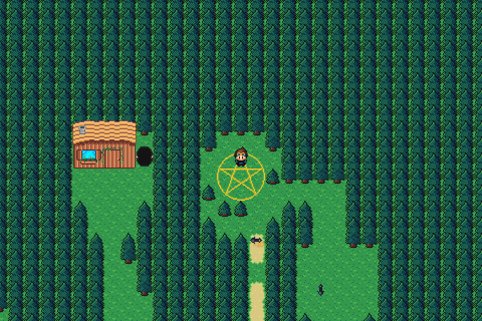
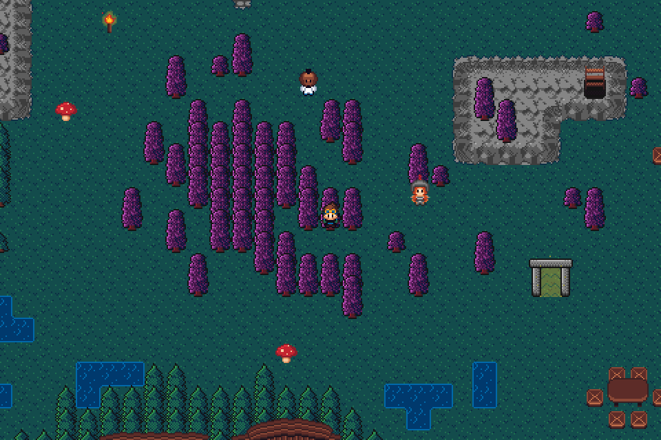
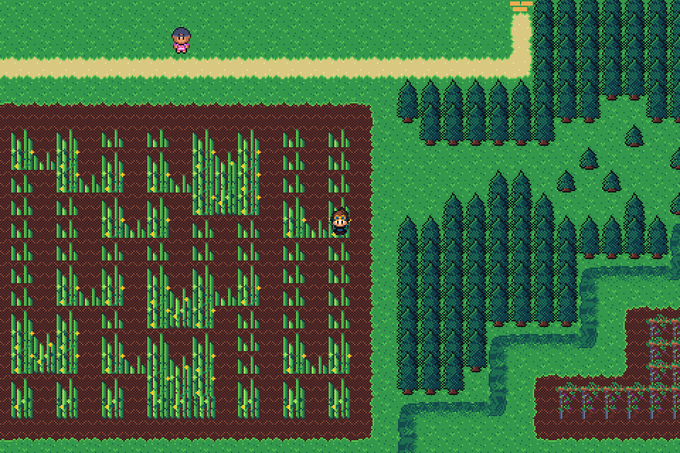

> Vibe-coded port of a game I wrote in Rust a couple of years ago

SneakBit is a top-down adventure-action game with close- and long-range combat, a
hand-drawn Gameboy-style world, and a story to wander through. This repository is
the **HTML5 / Canvas / vanilla JS** build of it — it runs in any browser, no
install, no plugins.

A previous version of the game was written in **Rust** (a `game_core` crate with
platform-specific renderers — raylib on desktop, CoreGraphics on iOS, Compose on
Android) and shipped on Steam, the App Store and Google Play. That earlier release
is preserved in this repository's history under the **`rust-core-tip`** tag (it was
a separate repo until the HTML build absorbed it). This HTML build
re-implements the runtime and renderer in plain JavaScript on top of an
HTML canvas, reusing the same art and level data, with the longer-term goal of
becoming the single codebase behind every platform (wrapped in Electron or similar).

## Screenshots

| | |
|---|---|
|  |  |
|  | |

> Captured straight from the live HTML build by `tools/screenshot.mjs` — give it a
> world id, a player tile and a viewport size in tiles and it boots the game to that
> spot and screenshots the canvas. See [docs/screenshot-tool.md](docs/screenshot-tool.md);
> the spec lives in [tools/screenshots.json](tools/screenshots.json).

## Features

* Adventure-action gameplay with melee (sword) and ranged (kunai) combat
* Pre-rendered dual-layer tiling system — biomes, constructions, animated objects
* Tile-locked, Gameboy-style movement (see [Movement model](#movement-model))
* **Online co-op** — up to four players share one world over WebRTC ([docs/online-coop.md](docs/online-coop.md))
* **Local co-op** — up to four players on one machine, one controller each
* **Turn-based PvP** — last bit standing; local play shipped, online specced ([docs/online-coop.md](docs/online-coop.md#pvp-turn-based))
* Keyboard and gamepad/controller support
* Localization via `tr()` (English + Italian)
* Fullscreen toggle

## Architecture

One feature, one file. See [CLAUDE.md](./CLAUDE.md) for the full guide and directory layout.

## Running it

No build step for development — serve the folder with any static HTTP server
(browsers block `fetch` on `file://`) and it loads the raw ES modules straight
from `js/`:

```bash
npm run serve            # python3 -m http.server 8000
# or
npx http-server -p 8000
```

Then open <http://localhost:8000>.

Production *is* bundled: `npm run build` (esbuild, the only devDependency) writes
a content-hashed single-file bundle into `_site/`. That's what ships — the public
build at <https://sneakbit.curzel.it> is deployed from the VPS via
`python3 deploy.py`, and the same `_site/` is mirrored to GitHub Pages by
[`.github/workflows`](./.github/workflows). Dev and the e2e harness never touch
the bundle; only deploys do.

## Tests

```bash
npm run test:unit        # fast inner loop (~2 s) — node --test
npm run test:e2e         # full e2e suite (~26 s; needs Chrome)
npm test                 # both, sequential
```

Tests have no dependencies of their own — unit tests use Node's built-in test
runner. E2E tests drive headless Chrome via raw CDP and self-skip if Chrome isn't
on the path. (The repo's one devDependency, esbuild, is for the production build
only — `npm ci` is needed to build, not to test.)

## Server

Online co-op is brokered by a tiny Node relay in [`server/`](./server) (vanilla
`node:http`, no deps). Run locally with `node server/index.js`. Full protocol spec
in [docs/online-coop.md](docs/online-coop.md).

## Controls

| Action | Keys |
|---|---|
| Move | `W` `A` `S` `D` / arrow keys |
| Ranged attack | `F` / `J` |
| Close attack | `R` / `Q` |
| Weapon selection | `TAB` |
| Confirm | `E` / `K` / `SPACE` |
| Menu | `X` / `ENTER` |
| Back | `ESCAPE` |

Gamepads are supported on desktop; local co-op requires one controller per extra player.

## Movement model

Gameboy-/Pokémon-style tile-locked stepping, implemented in `js/player.js`. This is
an intentional deviation from the earlier Rust release (which uses free-axis
movement) and shapes how other features get ported.

- The player always has a canonical integer tile (`tileX`, `tileY`). The rendered float position (`x`, `y`) only differs from it while a step is interpolating.
- **Tap to rotate.** A fresh press of a direction the player is NOT already facing rotates the sprite and starts a short commit timer (`ROTATE_COMMIT_DELAY`, 0.06 s). Release before the timer fires = pure rotate, no step.
- **Hold to step.** If the key is still held when the timer fires, commit one full-tile step over `STEP_DURATION` (0.22 s). Pressing the direction already faced skips the timer and commits immediately.
- **Queued inputs.** Presses arriving during a step go into a single-slot queue (last-wins). On snap: consume the queued direction and chain without a commit delay; or if the queue is empty but a direction is still held, chain that; otherwise become idle.

`input.js` exposes a per-tick `{ events, held }`: a FIFO of press events plus a snapshot of the held set. The player needs both to distinguish tap from hold and to handle the mid-step queue.

## Assets

Sprite sheets in `assets/` and level data in `data/` are vendored into this repo.
Their original sources — the `.aseprite` files and the canonical `data/` — live in
this repository's pre-port history under the `rust-core-tip` tag. To re-export a
sheet, pull the source out of the tag first:

```bash
git show rust-core-tip:aseprite/heroes.aseprite > /tmp/heroes.aseprite
/Applications/Aseprite.app/Contents/MacOS/aseprite \
  -b /tmp/heroes.aseprite --all-layers --sheet ./assets/heroes.png
```

## Credits

* Art, design, and original code by [Federico Curzel](https://github.com/curzel-it)
* Music by [Filippo Vicarelli](https://www.filippovicarelli.com/8bit-game-background-music)
* Sound effects by [SubspaceAudio](https://opengameart.org/content/512-sound-effects-8-bit-style)
* Font by [HarvettFox96](https://dl.dafont.com/dl/?f=pixel_operator)

## Contributing

PRs welcome — see [CONTRIBUTING.md](./CONTRIBUTING.md) and [CODE_OF_CONDUCT.md](./CODE_OF_CONDUCT.md).

## License

[MIT](./LICENSE) for the code in this repo. Third-party assets keep their original licenses (see Credits above).
