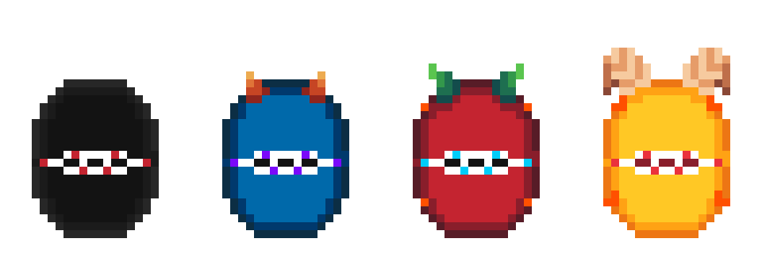

# Game Design Document
> Warning! 
> This document contains game spoilers, lots of AI generated slope and it's garbage in general.

## Overview
The game combines adventure and action elements, allowing players to explore a world populated by demons and to engage in combat with unique mechanics. The player can throw kunai (small knives) to defeat or weaken demonic creatures encountered throughout various landscapes, immersing the player in a journey with elements of both strategy and action wrapped in a gameboy-like pixel art aesthetics.
Local co-op is also available on PC.

## Game Modes
### Single Player
Default one, with story etc.

### Co-Op
Multiple players on a single machine, Steam Remote Play, etc.

Story can still progress, all players can move at the same time, with some action being limited to the main player.

### Turn-based Pvp
Multiple players on a single machine, Steam Remote Play, etc.

The feature is accessible from the arena in Duskhaven.

Still a work in progress, a single map is available.

## Architecture
### Tiling System
The levels are defined using a dual-layer tiling system system:
* The first layer represents biomes, which act as a background (water, grass, lava, rocky pavement, parquet, ...)
* The second one represents constructions, which act as a second layer of elements on the map

Both kinds of tiles can represent an obstacle, the player cannot walk on water, lava and over fences for example, but can walk over grass.
To mimic the effect of density, different construction tiles have different properties, for example some can reflect bullets (walls) while others don't.

Tiles are pre-rendered and distributed along with the game.

### Collision detection
Using classic AABB since version 1.7.

Biomes, constructions and entities each have a "hittable frame" of dynamic size.

## Combat System
* Monsters only attack melee for now
* Players can equip one melee and one ranged weapon.
* Skills can influence both weapons and bullets.
* Damage reduction is applied after damage multipliers.

### Ranged Weapons
Ranged weapons use ammunitions that can be found in-game.

Combat skills, bullets and weapons have different properties that are combined to calculate the damage.

#### Bullets
Bullets travel straight and inflict a damage per second, so the faster bullets are less effective.

|Ammo|Dps|Speed|Lifespan|
|--|--|--|--|
|Kunai|1800|7.0|1.4|
|.223 Rem|600|10.0|2.0|
|Cannonball|5000|8.0|2.0|

#### Weapons
|Weapon|Ammo|Dps Multiplier|Cooldown|
|--|--|--|--|
|Kunai Launcher|Kunai|1.0|0.15|
|AR15|.223 Rem|1.0|0.005|
|Dark AR|.223 Rem|2.5|0.005|
|Cannon|Cannonball|1.0|8.0|0.5|

### Melee Weapons
Melee weapons don't require ammunition, but the underlying mechanisms makes them fire invisible, slow and short-lived bullets, usually in a wider area than ranged weapons.

#### Weapons
|Weapon|Dps|Speed|Lifespan|Cooldown|
|--|--|--|--|--|
|Sword|450|2.0|0.4|0.35|
|Dark Blade|550|2.0|0.4|0.35|

#### Shields
|Weapon|Received Damage Reduction|
|--|--|
|Shield|20%|

### Monsters
There is a single kind of monster, but they can fuse to level up.

|Name|Dps|Hp|Speed|
|--|--|--|--|
|Grapeberry|150|80|3.0|
|Chokeberry|200|80|3.0|
|Blackberry|300|200|2.5|
|Blueberry|400|600|2.75|
|Strawberry|500|1300|3.05|
|Gooseberry|600|2000|3.4|
|Grapevine|500|4800|1.4|

### Skills
The player can complete optional quests to gain special combat skills.
|Name|Effect|
|--|--|
|Bouncing Knife|Makes kunai bounce off walls, enemies, etc|
|Knife Catcher|Allows the player to put back in the inventory kunai that come back at him|
|Piercing Knife|Doubles damage dealt by kunais|

All skills are passive, stackable and perpetual.

## Plot
### In Short
1. The MC wakes up in a forest, surrounded by a magic circle
1. Nearby, a strange wizard, pretends he has nothing to do with the summoning and tells the MC to go and learn more about this world since he's already here
1. (Optional) MC meets Punk, a weird guy who seems to know something about the MC
1. (Optional) MC can meet with several members of a family of ninjas and acquires combat skills
1. (Optional) MC meets with the scientists that research the Manafren trees and discovers the Demon Lord is still alive and is the reason the number of monsters is increasing
1. (Optional) MC discovers a profecy about a hero
1. (Optional) Wizard tells MC he can try and defeat the Demon Lord if he wants
1. (Optional) Punk is pissed once he discovers the MC wants to defeat the Demon Lord
1. MC discovers he needs to visit every dungeon to retrieve special keys in order to reach Demon Lord location
1. The blue and the black ninjas are the siblings of a girl in Evergrove, which tells them they are the children of the great Red Ninja
1. (Optional) MC meets Punk again in a dungeon while looking for keys, Punk says he's just there to train and kill some monsters
1. (Optional) MC meets Silver, Punk's father, who explain Punk is the real hero, but he decided to ignore his destiny
1. MC reaches Demon Lord location, but Punk is there and defeats him right before his eyes. Turns out Punk was the hero from the profecy all along and was actually getting ready to defeat the demon lord all along.

## Characters
### Main Cast 
#### MC
The player or main character, somebody who has recently been summoned to this world for unknown reasons.

#### Mogarth the Sage
The wise wizard who offers guidance and crucial information about the world’s magic and the looming threat of the Demon Lord.

#### Punk
A rebellious character destined to fulfill the prophecy by ultimately defeating the Demon Lord, challenging the MC's role as the hero.

### Secondary 
#### Dr. Alistair Voss
Head of the Manafren trees research initiative who guides the player in understanding the Manafern trees and their connection to the Demon Lord.

#### Lyria Kurogane
The girl with blue hair in Evergrove Village who provides assistance and information to the MC during their early adventures.

#### Blue Ninja
A skilled warrior from the ninja family who helps the MC acquire the Bouncing Knife skill through a dedicated side quest.

#### Black Ninja
A formidable member of the ninja family who mentors the MC in obtaining the Knife Catcher skill.

#### Red Ninja
The leader of the ninja siblings who grants the MC the Piercing Knife skill after completing prerequisite quests.

#### Silveroak
Punk's father, who reveals the truth behind Punk's destiny and the hero prophecy, adding depth to the narrative.

#### Elder Maren
The wise old woman from Duskhaven who provides lore about the Manafern trees and their significance to the world.

#### Serena Flameheart
A female soldier who offers support and combat assistance to the MC during critical battles.

#### Nyx
An assassin girl who plays a pivotal role in the story’s conflict, adding intrigue and complexity to the plot.

#### Captain 'Ironside' Thorne
A steadfast male soldier who leads the defense against the increasing demon incursions.

## Quests
The objective of the game is to defeat the Demon Lord, which by necessity leads the player to go through all dungeons in search of special keys.
Aside from that, the world is rich with quests, but they are all optional.

### Main Quest: Hero
The finale is always the same: Punk defeats the Demon Lord instead of the MC.
Completing (or ignoring) the "Hero" quest does not change this fact, but changes the relationship with NPCs, including Punk.
For example, if the MC does not interact with Punk at all, after the Demon Lord defeat Punk will simply as the MC who the hell he is.
Depending on the completion state, Punk might talk with a harsher tone for example.

The quest has the following steps:
1. (Optional) Meet Punk for the first time - Punk is pissed at the fact an outer-worlder has been summoned
2. (Optional) Meet Punk for the second time - Punk expresses doubts about the concept of "a hero"
3. (Optional) Meet Punk for the third time - Punk is pissed as MC seems to follow him
4. (Optional) Meet Punk for the fourth time - Punk is enranged by the mistrust of others
5. (Optional) Meet Silver for the first time - Silver reveals he's Punk's father, the hero profecy is Punk's profecy and Punk has given up of being the hero
6. Reach Demon Lord location - A cutscene shows Punk defeating the Demon Lord
7. (Optional) Talk to Punk - Punk response changes based on the completion state of the quest

Reward: Player wins the game

### Side Quest: Bouncing Knifes
1. (Optional) Meet with Lyria Kunogane in Evergrove
2. Meet with the Blue Ninja
3. Meet with his sister Lyria in Evergrove
4. Go back to the Blue Ninja

Reward: Bouncing knifes skill

### Side Quest: Knife Catcher
1. (Optional) Meet with Lyria Kunogane in Evergrove
2. Meet with the Black Ninja
3. Meet with his sister Lyria in Evergrove
4. Go back to the Black Ninja

Reward: Knife catcher skill

### Side Quest: Piercing Knifes
1. (Optional) Meet with the Red Ninja, who reveals he's the head of the Kunogane family
2. Complete the "Bouncing Knifes" quest
3. Complete the "Knife catcher" quest
4. Meet with the Red Ninja

Reward: Piercing Knife skill

### Side Quest: My old sword
1. (Optional) Meet with the guy with a pink shirt in Peak Levek
2. Go back to Evergrove to visit his house
3. Pick up the sword

Reward: Keep the sword

### Side Quest: Manafren Research
1. Meet with Dr Voss
2. (Optional) Talk to the village elder
3. (Optional) Read the scroll in the dungeon
4. Find the old book in the mountains to the East
5. Report your findings to Dr Voss

Reward: 10x Kunai

### Side Quest: Thugs and Assassins
1. Meet with Thermoria village chief - he called assassins to get rid of the thugs
1. Meet with the assassins - they are about to strike, just waiting to finish coffee
1. Meet with the thugs - they are not thugs, just unpaid workers
1. Meet with the village chief - he did pay them with checks
1. Meet with the thugs - they don't know what a check is
1. Meet with the village chief - he sends them crypto

Reward: Thugs are gone and the passage to Maritide Have via Thermoria's dock

## Locations

After visiting any 4 cities fast travel is unlocked and will be available as a portal in all major cities.

### Evergrove Village (1001)
The small village near the spawn location of the MC.

### Verdant Way (1002)
A network of paths in the forest near Evergrove that connect various locations:
* Evergrove Village
* Murkmire Swamps
* Aridreach
* Shadowveil Path

### Shadowveil Path (1010)
A network of paths in a dark near Verdant Way that connects:
* Verdant Way
* Demon Maze
* Vintoria

### Aridreach (1003)
A city built on top of a mountain in the middle of what is now Grimsun desert.
The once lush environment has left way to a vast expanse of sand, on which the largest solar farm of the continent is built.
The city also acts as the passage way to Grimsun Basin, a hot, deathly pile of sand and narrow passages between rocky mountinas.

### Murkmire Swamps (1018)
Murkmire Swamp is a vast, foreboding wetland that stretches from the internal lands of the continent all the way to the South coast.
The network of paths in the swamps connect:
* Verdant Way
* Duskhaven
* Thermoria

### Demon Maze (1017)
A dark, misterious maze full of monsters. 
Legend says the throne of the Demon Lord is at the center of the maze.

### Thermoria (1006)
A group of interconnected islands off the cost of Verdant Way.
A still active volcano, Mount Ignis, is now at the core of a geothermal power plant.
A vast dungeon is accessible from underneath the geothermal plant.

### Maritide Haven (1008)
Originally a large island, a terrific incident in the underground mine cause the town to collapse under the sea.
Lots of time has passed since then, the landscape now looks like a small arcipelago.
Due to the unique conditions that created the islands and the amount of underground cavities, a series of whirpools surrounds the area.
The remote location is now only accessible from Thermoria using a particular naval route.

### Duskhaven (1011)
Duskhaven is a small touristic village, the only place where Manafren trees still grow.
The trees are essetial to the town not just as a popular turist attraction, but also as a source of mana.
An ancient underground power plant converts the mana into electricity.
In order to study the trees, there are frequent visits by scientists and researchers from all over the world.

### Vintoria (1012)
Vintoria is a mountain village, home to the best wineries in the continent.
The river than once carved the valley has been redirected to an hydroelectric power plant.
The basement of the power plant is embedded in the mountain and is built on multiple levels.

### Peak Levek (1020)
Peak Levek is the tallest mountain in the game in the continent, well above the freezing point.
At the foot of the mountain, there has always been a small community of woodcutters, but since ancient ruins were discovered, many of the archaeologists involved in the exploration have decided to move there.

## Flora and Fauna

### Animals
There's several household animals, but they don't serve any purpose aside from decoration.

### The eyeless monsters
The first and most common kind of monster, usually seen in his black variant. 
The attack on sight and deal damage with their teeth-filled mouth. 
When two ore more monsters run into each other, one of the two will absorbe the other, triggering a trasformation into a more fearsome version of the creature.

See *Combat System* for more info.

### Manafren trees
The Manafern Trees, native to the twilight land of Duskhaven, are renowned for their mystical energy properties, marked by vibrant purple leaves that absorb ethereal particles from the soil and air. 
Through a unique, photosynthesis-like process, the Manaferns convert these particles into pure mana, illuminating the region and powering its ecosystem. 